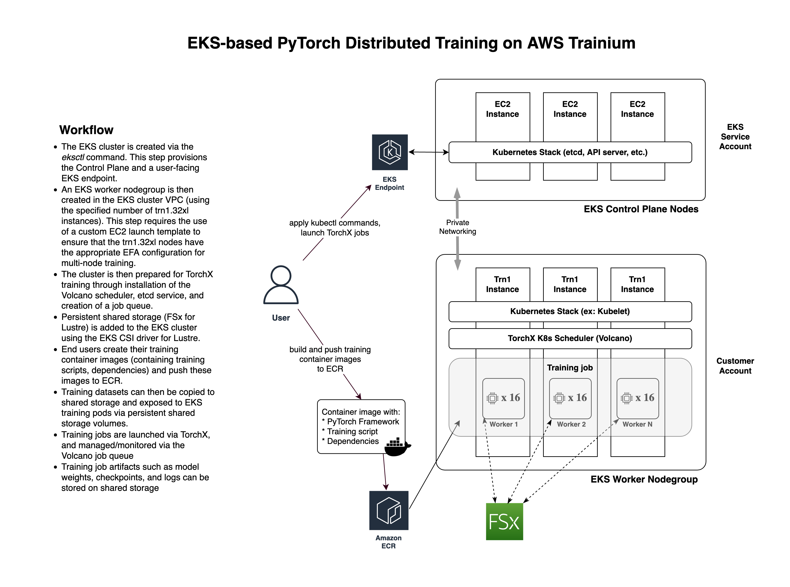

# Tutorial: Launch a Multi-Worker PyTorch Neuron Training Job on Trainium Using TorchX and EKS

## Overview <a name="overview2"></a>

This tutorial shows how to launch a multi-worker PyTorch Neuron training job on multiple Trn1 nodes within an Amazon Elastic Kubernetes Service (EKS) cluster. In this example, the BERT-large model will undergo DataParallel-based phase1 pretraining using the WikiCorpus dataset. TorchX will be used to launch the job on 2 trn1.32xlarge instances, with 32 workers per instance.

The tutorial covers all steps required to prepare the EKS environment and launch the training job:

* [Prepare a jumphost](#prepjumphost)
* [Create an ECR repo](#createecr)
* [Create an EKS cluster](#createekscluster)
* [Install TorchX and Volcano](#installtorchxandvolcano)
* [Install FSx for Lustre CSI driver](#installfsxcsi)
* [Build the BERT pretraining container and push to ECR](#buildtrainingcontainer)
* [Copy BERT pretraining data to FSx for Lustre persistent volume](#copybertdata)
* [Precompile BERT graphs using neuron_parallel_compile](#precompilebert)
* [Launch 64-worker BERT pretraining job using TorchX](#launchtraining)
* [Monitor the training job](#monitortraining)
* [View the training job in Tensorboard](#tensorboard)
* [Monitor Neuron device utilization using neuron-top](#neurontop)
* [Clean-up tutorial resources](#cleanup)



## Prepare a jump host <a name="prepjumphost"></a>

This tutorial assumes that you will use an x86-based Linux jump host to launch and manage the EKS cluster and PyTorch Neuron training jobs.

**Note:** It is highly recommended that you use the same IAM user/role to create and manage your EKS cluster. If you create your EKS cluster using one user/role and then attempt to manage it using a different user/role within the same account, you will need to [modify your EKS configuration](https://docs.aws.amazon.com/eks/latest/userguide/add-user-role.html) to provide `system-masters` access to the 2nd user/role.

If you prefer to use your local computer instead of a jump host, please ensure that your computer is x86-based. Attempting to launch training jobs via TorchX from a non-x86 host (ex: an ARM-based M1 Mac) will lead to errors because the resulting Docker containers will be built for the wrong architecture.


### Launch a Linux jump host

Begin by choosing an AWS region that supports both EKS and Trainium (ex: us-east-1, us-west-2). In this tutorial we will assume the use of `us-west-2`.

In your chosen region, use the AWS Console or AWS CLI to launch an instance with the following configuration:

* **Instance Type:** t3.large
* **AMI:** Amazon Linux 2 AMI (HVM)
* **Key pair name:** (choose a key pair that you have access to) 
* **Auto-assign public IP:** Enabled
* **Storage:** 100 GiB root volume


### Configure AWS credentials on the jump host

#### 1. Create a new IAM user in the AWS Console:

Refer to the [AWS IAM documentation](https://docs.aws.amazon.com/IAM/latest/UserGuide/id_users_create.html#id_users_create_console) in order to create a new IAM user with the following parameters:

* **User name:** eks_tutorial
* **Select AWS credential type:** enable `Access key - Programmatic access`
* **Permissions:** choose _Attach existing policies directly_ and then select `AdministratorAccess`

Be sure to record the ACCESS_KEY_ID and SECRET_ACCESS_KEY that were created for the new IAM user.

#### 2. Log into your jump host instance using one of the following techniques:

* Connect to your instance via the AWS Console using [EC2 Instance Connect](https://docs.aws.amazon.com/AWSEC2/latest/UserGuide/Connect-using-EC2-Instance-Connect.html)
* SSH to your instance's public IP using the key pair you specified above.
  * Ex: `ssh -i KEYPAIR.pem ec2-user@INSTANCE_PUBLIC_IP_ADDRESS`

#### 3. Configure the AWS CLI with your IAM user's credentials:

Run `aws configure`, entering the ACCESS_KEY_ID and SECRET_ACCESS_KEY you recorded above. For _Default region name_ be sure to specify the same region used to launch your jump host, ex: `us-west-2`.

<pre style="background: black; color: #ddd">
bash> <b>aws configure</b>
AWS Access Key ID [None]:  ACCESS_KEY_ID
AWS Secret Access Key [None]: SECRET_ACCESS_KEY
Default region name [None]: us-west-2
Default output format [None]: json
</pre>

### Clone this repo to your jump host

```
sudo yum install -y git
git clone https://github.com/aws-neuron/aws-neuron-eks-samples.git
cd aws-neuron-eks-samples/dp_bert_hf_pretrain
```


### Install and configure eksctl, kubectl, and Docker on the jump host

#### 1. Install eksctl using the following commands:

```
curl --silent --location "https://github.com/weaveworks/eksctl/releases/latest/download/eksctl_$(uname -s)_amd64.tar.gz" | tar xz -C /tmp
sudo mv /tmp/eksctl /usr/local/bin
```

Run `eksctl version` to confirm that eksctl has been installed correctly:

<pre style="background: black; color: #ddd">
bash> <b>eksctl version</b>
0.117.0
</pre>

#### 2. Install kubectl using the following commands:

```
curl -o kubectl https://s3.us-west-2.amazonaws.com/amazon-eks/1.23.7/2022-06-29/bin/linux/amd64/kubectl
chmod u+x kubectl
sudo mv kubectl /usr/local/bin
```

Run `kubectl version |& grep GitVersion` to confirm that kubectl has been installed correctly:

<pre style="background: black; color: #ddd">
bash> <b>kubectl version |& grep GitVersion</b>
Client Version: version.Info{Major:"1", Minor:"23+", GitVersion:"v1.23.7-eks-4721010", 
GitCommit:"b77d9473a02fbfa834afa67d677fd12d690b195f", GitTreeState:"clean", BuildDate:"2022-06-27T22:22:16Z", 
GoVersion:"go1.17.10", Compiler:"gc", Platform:"linux/amd64"}
</pre>

**Note:** The above commands will install kubectl version `1.23.7`. If you require a different version of kubectl, please refer to the [EKS documentation](https://docs.aws.amazon.com/eks/latest/userguide/install-kubectl.html).

#### 3. Install Docker using the following commands:

```
sudo yum install -y docker jq
sudo service docker start
sudo usermod -aG docker ec2-user
```

**Note:** You will need to disconnect/reconnect to your jump host (or run `newgrp docker`) before you will be able to run any Docker commands on the jump host.

#### 4. Install and configure docker-credential-ecr-login

TorchX depends on the docker-credential-ecr-login helper to authenticate with your ECR repository in order to push/pull container images. Run the following commands to install and configure the credential helper:

```
mkdir -p ~/.docker
cat <<EOF > ~/.docker/config.json
{
    "credsStore": "ecr-login"
}
EOF

sudo yum install -y amazon-ecr-credential-helper
```

<br/>
<br/>
<br/>

## Create ECR repo <a name="createecr"></a>

When working with TorchX, a container repository is required to host the container images that are used to launch and run training jobs. Run the following command to create a new Elastic Container Registry (ECR) repository called **eks_torchx_tutorial**:

```
aws ecr create-repository --repository-name eks_torchx_tutorial
```

Confirm that the repository was successfully created by running:

```
aws ecr describe-repositories --repository-name eks_torchx_tutorial --query repositories[0].repositoryUri
```

 If successful, the command will output the URI of your new ECR repository:

<pre style="background: black; color: #ddd;">
bash> <b>aws ecr describe-repositories --repository-name eks_torchx_tutorial --query repositories[0].repositoryUri</b>
"000000000000.dkr.ecr.us-west-2.amazonaws.com/eks_torchx_tutorial"
</pre>

<br/>
<br/>
<br/>


## Create EKS cluster <a name="createekscluster"></a>

#### 1. Determine which availability zones will be used by EKS

When provisioning an EKS cluster you need to specify 2 availability zones for the cluster. For this tutorial, it is important to choose 2 availability zones that support AWS Trainium. Run following commands to automatically choose the appropriate availability zones for the us-west-2 region:

```
./scripts/determine_eks_azs.sh
```

If the command is successful you will see a message similar to the following:

<pre style="background: black; color: #ddd">
bash> <b>./scripts/determine_eks_azs.sh</b>

Your EKS availability zones are us-west-2d and us-west-2c
</pre>

#### 2. Create an EKS cluster manifest by running the following commands:

```
./scripts/create_eks_cluster_manifest.sh
```

<pre style="background: black; color: #ddd">
bash> <b>./scripts/create_eks_cluster_manifest.sh</b>

Successfully wrote eks_cluster.yaml
</pre>

#### 3. Examine the EKS cluster manifest

```
cat eks_cluster.yaml
```

Your EKS cluster manifest should look similar to the following:

<pre style="background: black; color: #ddd">
apiVersion: eksctl.io/v1alpha5
kind: ClusterConfig

metadata:
  name: my-trn1-cluster
  region: us-west-2
  version: "1.23"

iam:
  withOIDC: true

availabilityZones: ["us-west-2d","us-west-2c"]
</pre>


#### 4. Create the EKS cluster from the manifest:

```
eksctl create cluster -f eks_cluster.yaml
```

It may take a few minutes to create the EKS cluster. Once complete, you will be able to see your new cluster in the output of the `eksctl get cluster` command:

<pre style="background: black; color: #ddd">
bash> <b>eksctl get cluster</b>
NAME             REGION     EKSCTL CREATED
my-trn1-cluster	 us-west-2  True
</pre>


#### 5. Create EKS Trn1 Nodegroup resources

Run create_cfn_params.sh to create the parameters required for the EKS Nodegroup resources CloudFormation template:

```
./scripts/create_cfn_params.sh
```

Then create the EKS Nodegroup resources CloudFormation stack using the provided template and newly created parameters file:

```
aws cloudformation create-stack \
--stack-name eks-ng-stack \
--template-body file://cfn/eks_ng_stack.yaml \
--parameters file://cfn_params.json \
--capabilities CAPABILITY_IAM
```

Periodically run the following command until `StackStatus` is reported as **CREATE_COMPLETE**:

```
aws cloudformation describe-stacks --stack-name eks-ng-stack|grep StackStatus
```

#### 6. Create the EKS Trn1 Nodegroup

First generate the EKS Nodegroup manifest file:

```
./scripts/create_eks_trn1_ng_manifest.sh
```

Next, use eksctl to create the EKS Nodegroup from the manifest:

```
eksctl create nodegroup -f trn1_nodegroup.yaml
```

Now confirm that your Trn1 Nodegroup is active by running the following command:

```
eksctl get nodegroup --cluster my-trn1-cluster
```

#### 7. Install Neuron and EFA k8s plugins

In order to use Trn1 instances with EKS, a few Neuron and EFA plugins are required. Run the following `kubectl` commands to install the Neuron, Neuron RBAC, and EFA plugins on your new EKS cluster:

```
kubectl apply -f https://awsdocs-neuron.readthedocs-hosted.com/en/latest/_downloads/f57f27621e52b305dba7d624c477977a/k8s-neuron-device-plugin.yml
kubectl apply -f https://awsdocs-neuron.readthedocs-hosted.com/en/latest/_downloads/46fb1da6e5e79c3310ebc0cbd6ad2353/k8s-neuron-device-plugin-rbac.yml
kubectl apply -f https://raw.githubusercontent.com/aws-samples/aws-efa-eks/main/manifest/efa-k8s-device-plugin.yml
```

Next, run `kubectl get pods -n kube-system` and verify that the EFA and Neuron daemonsets are running:

<pre style="background: black; color: #ddd">
bash> <b>kubectl get pods -n kube-system</b>
NAME                                        READY   STATUS    RESTARTS   AGE
<b>aws-efa-k8s-device-plugin-daemonset-gpntd   1/1     Running   0          59s</b>
<b>aws-efa-k8s-device-plugin-daemonset-v79qx   1/1     Running   0          59s</b>
aws-node-bgs5l                              1/1     Running   0          14h
aws-node-z6rjf                              1/1     Running   0          14h
coredns-57ff979f67-fm72z                    1/1     Running   0          14h
coredns-57ff979f67-m2mcj                    1/1     Running   0          14h
kube-proxy-7m8zk                            1/1     Running   0          14h
kube-proxy-7rxhq                            1/1     Running   0          14h
<b>neuron-device-plugin-daemonset-cpdz8        1/1     Running   0          51s</b>
<b>neuron-device-plugin-daemonset-nvb8s        1/1     Running   0          51s</b>
</pre>

<br/>
<br/>
<br/>

## Install and configure TorchX and Volcano <a name="installtorchxandvolcano"></a>

[TorchX](https://pytorch.org/torchx/main/) is a universal launcher for PyTorch jobs, and supports a variety of schedulers including AWS Batch, Docker, Kubernetes, Slurm, Ray, and more. 

This tutorial makes use of the Kubernetes scheduler, which depends on the open-source [Volcano batch system](https://github.com/volcano-sh/volcano).

In this section, you will install Volcano and then configure a job queue.

#### 1. Install Volcano and ETCD by running the following commands on the jump host:

```
kubectl apply -f https://raw.githubusercontent.com/volcano-sh/volcano/master/installer/volcano-development.yaml
kubectl apply -f https://raw.githubusercontent.com/pytorch/torchx/main/resources/etcd.yaml
```

#### 2. Create a test queue in Volcano

In order for TorchX to use Volcano at least one job queue must be defined in Volcano. Run the following commands to create a simple test queue:

```
./scripts/create_volcano_test_queue.sh
```

If the command is successful you will see a message similar to the following:

<pre style="background: black; color: #ddd">
queue.scheduling.volcano.sh/test created
</pre>

#### 3. Install TorchX

Use pip to install TorchX on the jump host:

```
pip3 install torchx[kubernetes]
```

<br/>
<br/>
<br/>


## Install and configure FSx for Lustre CSI <a name="installfsxcsi"></a>

In this tutorial, TorchX is used to launch a DataParallel BERT phase1 pretraining job using 64 workers across 2 trn1.32xlarge instances (32 workers per instance). 

BERT phase1 pretraining uses a 50+ GB WikiCorpus dataset as the training dataset. For large datasets such as this, it is inefficient to include the dataset inside the training container image or to download the dataset at the beginning of each training job. A more efficient approach is to use a Kubernetes persistent shared storage volume to host the dataset.

The following steps show how to host the WikiCorpus dataset on a shared volume provided by [FSx for Lustre](https://docs.aws.amazon.com/fsx/latest/LustreGuide/what-is.html).

#### 1. Install the FSx for Lustre CSI driver on the EKS cluster

First run the following command to create the appropriate FSX CSI service account on the EKS cluster:

```
./scripts/create_fsx_serviceaccount.sh
```

Next, run the following commands to install the FSx for Lustre CSI driver on the EKS cluster:

```
kubectl apply -k "github.com/kubernetes-sigs/aws-fsx-csi-driver/deploy/kubernetes/overlays/stable/?ref=master"
```

If successful, an entry for `fsx.csi.aws.com` will appear in the output of the `kubectl get csidriver` command:

<pre style="background: black; color: #ddd">
bash> <b>kubectl get csidriver</b>
NAME              ATTACHREQUIRED   PODINFOONMOUNT   STORAGECAPACITY   TOKENREQUESTS   REQUIRESREPUBLISH   MODES        AGE
efs.csi.aws.com   false            false            false             <unset>         false               Persistent   37m
<b>fsx.csi.aws.com   false            false            false             <unset>         false               Persistent   16s</b>
</pre>


#### 2. Create storage class manifest for Lustre:

```
./scripts/create_storageclass_manifest.sh
```

#### 3. Apply the storage class manifest to the EKS cluster:

```
kubectl apply -f storageclass.yaml
```

#### 4. Create Kubernetes persistent volume claim (PVC) manifest for Lustre storage:

```
./scripts/create_lustre_pv_claim.sh
```

#### 5. Apply the persistent volume claim manifest to the EKS cluster:

```
kubectl apply -f claim.yaml
```

#### 6. Confirm that the persistent volume claim is 'bound' to the EKS cluster:

Periodically run `kubectl get pvc` until you see the _STATUS_ column indicate "Bound" in the output:

<pre style="background: black; color: #ddd">
bash> <b>kubectl get pvc</b>
NAME        STATUS   VOLUME                                     CAPACITY   ACCESS MODES   STORAGECLASS   AGE
fsx-claim   Bound    pvc-1f978c29-dd54-4b41-ba65-c2708ef152fa   1200Gi     RWX            fsx-sc         5m
</pre>

<br/>
<br/>
<br/>

## Build the BERT pretraining container image and push it to ECR<a name="buildtrainingcontainer"></a>

Run the following commands on the jump host to build the pretraining container image and push it into your ECR repository:

```
ECR_REPO=$(aws ecr describe-repositories --repository-name eks_torchx_tutorial \
    --query repositories[0].repositoryUri --output text)
docker build ./docker -t $ECR_REPO:bert_pretrain
docker push $ECR_REPO:bert_pretrain
```

<br/>
<br/>
<br/>


## Copy BERT pretraining dataset to the Lustre-hosted persistent volume <a name="copybertdata"></a>

#### 1. Create a manifest for a command shell pod that can be used to access the persistent volume:

```
./scripts/create_cmd_shell_pod_manifest.sh
```

#### 2. Apply the command shell pod manifest:

```
kubectl apply -f cmd_shell_pod.yaml
```

#### 3. Open an interactive bash prompt on the command shell pod:

```
kubectl exec -it cmd-shell -- /bin/bash
```

#### 4. Copy and extract the WikiCorpus dataset to the persistent volume:

Run the following commands from within the bash prompt on the command shell pod:

```
cd /data
aws s3 cp s3://neuron-s3/training_datasets/bert_pretrain_wikicorpus_tokenized_hdf5/bert_pretrain_wikicorpus_tokenized_hdf5_seqlen128.tar . --no-sign-request
tar xvf bert_pretrain_wikicorpus_tokenized_hdf5_seqlen128.tar
```

When the above commands have completed, you can exit the command shell pod by typing `exit` or pressing CRTL-D.

Please delete the cmd-shell app by running:
```
kubectl delete pod cmd-shell

```


<br/>
<br/>
<br/>

## Precompile the BERT graphs using neuron_parallel_compile <a name="precompilebert"></a>

PyTorch Neuron comes with a tool called [neuron_parallel_compile](https://awsdocs-neuron.readthedocs-hosted.com/en/latest/frameworks/torch/torch-neuronx/api-reference-guide/training/pytorch-neuron-parallel-compile.html) which reduces graph compilation time by extracting model graphs and then compiling the graphs in parallel. The compiled graphs are stored on the shared storage volume where they can be accessed by the worker nodes during model training.

To precompile the BERT graphs, run the following commands:

```
ECR_REPO=$(aws ecr describe-repositories --repository-name eks_torchx_tutorial \
    --query repositories[0].repositoryUri --output text)

torchx run \
    -s kubernetes --workspace="file:///$PWD/docker" \
    -cfg queue=test,image_repo=$ECR_REPO \
    lib/trn1_dist_ddp.py:generateAppDef \
    --name bertcompile \
    --script_args "--batch_size 16 --grad_accum_usteps 32 \
        --data_dir /data/bert_pretrain_wikicorpus_tokenized_hdf5_seqlen128 \
        --output_dir /data/output --steps_this_run 10" \
    --nnodes 2 \
    --nproc_per_node 32 \
    --image $ECR_REPO:bert_pretrain \
    --script dp_bert_large_hf_pretrain_hdf5.py \
    --bf16 True \
    --cacheset bert-large \
    --precompile True
```

When the precompile command completes, you should see a message indicating that the 5 graphs have compiled successfully.

In the above command you will note various options that are passed to the `torchx run` command:

* `-s kubernetes`: Selects the Kubernetes scheduler
* `--workspace "file:///$PWD/docker"`: Specifies a local workspace directory that TorchX will overlay on top of the base training container image as part of the training job. This can be used to add a new training script and dependencies to the training container, modify an existing training script, add a small dataset to the container, etc. In this tutorial, we use the local docker build directory as the workspace, however, the workspace directory can be any local directory. Note: the local workspace directory is overlayed at the root of the training container, so you need to be careful not to accidentally overwrite required system directories such as `/bin`, `/lib`, or `/etc`, otherwise your TorchX container might not be able to run.
* `-cfg queue=test,image_repo=ECR_REPO`: Configures the job queue and ECR repo used for TorchX images
* `lib/trn1_dist_ddp.py:generateAppDef`: Path to the Python function used to programmatically create the TorchX AppDef for this job. See [lib/trn1_dist_ddp.py](lib/trn1_dist_ddp.py) for additional details.
* `--name bertcompile`: Name of this TorchX job
* `--script_args "..."`: Command-line arguments that will be passed to the training script. When performing precompilation, it is advised to limit the number of training steps to ~10 as we do here using `--steps_this_run 10`
* `--nnodes 2`: Number of trn1.32xl nodes required for this job
* `--nproc_per_node 32`: Number of training processes to run per node
* `--image $ECR_REPO:bert_pretrain`: The container image to use for the training job
* `--script dp_bert_large_hf_pretrain_hdf5.py`: Name of the training script to run inside the training container
* `--bf16 True`: Enable BF16 data type for training
* `--cacheset bert-large`: A user-specified string used to prefix the Neuron and Transformers caches on shared storage. The cacheset can be shared across TorchX jobs but should not be used by jobs that will run concurrently. If multiple concurrent jobs share a cacheset, cache corruption could occur.
* `--precompile True`: Launch the training script using Neuron's `neuron_parallel_compile` tool in order to precompile the graphs

<br/>
<br/>
<br/>

## Launch BERT pretraining job using 64 workers across 2 trn1.32xlarge instances <a name="launchtraining"></a>

Run the following commands to launch the 64-worker BERT pretraining job on the EKS cluster:

```
ECR_REPO=$(aws ecr describe-repositories --repository-name eks_torchx_tutorial \
    --query repositories[0].repositoryUri --output text)

torchx run \
    -s kubernetes --workspace="file:///$PWD/docker" \
    -cfg queue=test,image_repo=$ECR_REPO \
    lib/trn1_dist_ddp.py:generateAppDef \
    --name berttrain \
    --script_args "--batch_size 16 --grad_accum_usteps 32 \
        --data_dir /data/bert_pretrain_wikicorpus_tokenized_hdf5_seqlen128 \
        --output_dir /data/output" \
    --nnodes 2 \
    --nproc_per_node 32 \
    --image $ECR_REPO:bert_pretrain \
    --script dp_bert_large_hf_pretrain_hdf5.py \
    --bf16 True \
    --cacheset bert-large
```

<br/>
<br/>
<br/>

## Monitor training job progress <a name="monitortraining"></a>

Run the following command to check the status of the recently submitted training job:

```
kubectl get vcjob
```

<pre style="background: black; color: #ddd">
bash> <b>kubectl get vcjob</b>
NAME                  STATUS    MINAVAILABLE   RUNNINGS   AGE
bert-kd5hpckt1vs3jd   Running   2              2          41m
</pre>

<br/>

When the status of your job shows as `Running`, use the following command to identify the pods associated with the job:

```
kubectl get pods
```

<pre style="background: black; color: #ddd">
bash> <b>kubectl get pods</b>
NAME                            READY   STATUS    RESTARTS   AGE
bert-kd5hpckt1vs3jd-role1-0-0   1/1     Running   0          41m
bert-kd5hpckt1vs3jd-role1-1-0   1/1     Running   0          41m
</pre>

<br/>

To view the training script output, you first need to know which of the running pods represents the rank0 worker in the distributed training job. For the BERT pretraining script, only the rank0 worker outputs training metrics. During training job initialization, rank is randomly assigned among the participants, and is not directly related to the pod name. You can determine the rank0 worker by running the following script:

```
./scripts/find_rank0_pod.sh
```

<pre style="background: black; color: #ddd">
bash> <b>./scripts/find_rank0_pod.sh</b>
YOUR_POD_NAME is your rank0 worker pod.
</pre>

Once you have determined the name of your rank0 worker pod, you can substitute the pod name into the following command to view the training script output. If you do not see training metrics in the logs (as shown below), please wait 1-2 minutes and re-run the command.

```
kubectl logs YOUR_POD_NAME|tail -3
```

<pre style="background: black; color: #ddd">
bash> <b>kubectl logs YOUR_POD_NAME|tail -3</b>
[0]:LOG Tue Nov 15 17:54:03 2022 - (0, 394) step_loss : 7.5938 learning_rate : 7.88e-05 throughput : 5518.14
[0]:LOG Tue Nov 15 17:54:09 2022 - (0, 395) step_loss : 7.6250 learning_rate : 7.90e-05 throughput : 5534.33
[0]:LOG Tue Nov 15 17:54:15 2022 - (0, 396) step_loss : 7.6250 learning_rate : 7.92e-05 throughput : 5528.64
</pre>

To continously view the training script output (similar to the `tail -f` command in Linux), you can use the following command. The command can be terminated using CTRL-C.

```
kubectl logs -f YOUR_POD_NAME
```

<br/>
<br/>
<br/>

## View training progress in Tensorboard <a name="tensorboard"></a>

The BERT training job also stores training metrics on the FSx for Lustre shared storage volume. To view these metrics in Tensorboard, you can launch a Tensorboard deployment within the EKS environment using the following script:

```
./scripts/deploy_tensorboard_pod.sh

```

The script will first build a Tensorboard container and push it to your ECR repository. Next, the Tensorboard deployment will be launched within your EKS cluster. When the script completes, it will output a password-protected URL that you can use to access Tensorboard. Please note that it may take 1-2 minutes for the URL to become accessible.

<br/>
<br/>
<br/>

## Monitor Neuron device utilization using neuron-top <a name="neurontop"></a>

The Neuron SDK provides [Neuron tools](https://awsdocs-neuron.readthedocs-hosted.com/en/latest/tools/index.html#neuron-tools) for monitoring Neuron devices on Inf1 and Trn1 instances. During a training job it is often useful to monitor Neuron device utilization using `neuron-top`, which provides a text-based view of device and memory utilization.

To view `neuron-top` statistics for one of your nodes, begin by choosing one of your running BERT training pods:

```
kubectl get pods|grep Running|grep bert
```

Substitute the name of one of your running pods into the following command to launch a bash prompt within the running pod:

```
kubectl exec -it YOUR_POD_NAME -- /bin/bash
```

At the bash prompt, run `neuron-top`:

```
neuron-top
```

When you are finished exploring `neuron-top`, press `q` to quit. At the pod's bash prompt, press `CTRL-D` to return to your jump host.

<br/>
<br/>
<br/>

## Clean-up <a name="cleanup"></a>

When you are finished with the tutorial, run the following commands on the jump host to remove the EKS cluster and associated resources:

```
# Delete Tensorboard deployment
kubectl delete -f tensorboard_manifest.yaml

# Delete any remaining pods
kubectl delete pods --all

# Delete FSX resources
kubectl delete -f storageclass.yaml
kubectl delete -f claim.yaml

# Delete nodegroup
eksctl delete nodegroup trn1-ng1 --cluster my-trn1-cluster

# Delete Cluster resources
aws cloudformation delete-stack --stack-name eks-ng-stack
eksctl delete cluster my-trn1-cluster

# Delete Container repository
aws ecr delete-repository --force eks_torchx_tutorial
```

Lastly, terminate your jump host instance via the AWS Console.

