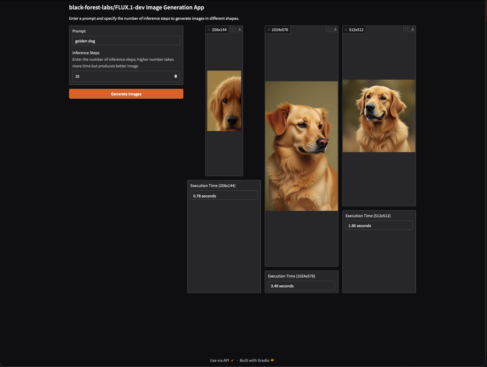

# Compile and serve ultra large vision transformers like Flux on Neuron devices at scale

[FLUX.1 dev](https://huggingface.co/black-forest-labs/FLUX.1-dev) is a 12 billion parameter rectified flow transformer capable of generating images from text. This example illustrates how to optimize its usage on Neuron devices that power EC2 Inferentia (Inf2) and Trainium (Trn1) instances deployed on EKS. Since the FLUX.1 dev model cannot fit on a single Neuron device, neuronx_distributed splits the model transformer into `N=8` chunks along a dimension. This ensures that each device holds only `1/N` chunk of the tensor. By performing partial chunk computation, the model generates partial outputs from all devices, maintaining accuracy and producing high-quality images. However, loading the traced model graph before serving significantly impacts the model loading time. This depends on the `tp_degree`, `N`, and the produced model graph traces `*.pt` need to be loaded during deployment and integrated into the OCI image, which can lead to prolonged load times. To address this, we cache the model traces (in the range of 10 GB) in [S3 Mountpoints](https://docs.aws.amazon.com/eks/latest/userguide/s3-csi.html), decoupling the OCI model load time from the model traces load time.

Next, we determine the compute type we intend to use. The initial step involves loading the model, executing a single inference, and assessing the image quality based on the number of inference steps. Subsequently, we determine the minimum inference latency with `Trn1` and `Inf2` under the specified acceptable quality parameters, currently set to `num_inference_steps`. Finally, we load each deployment unit, such as Flux on Trn1 8 Neuron devices or Flux on Inf2 6 Neuron devices, until it reaches its breaking point where the latency exceeds the acceptable thresholds. We measure the Neuron cores utilization using the built-in [Neuron monitoring tools](https://awsdocs-neuron.readthedocs-hosted.com/en/latest/general/monitoring-tools.html#monitoring-tools) that are included in Container Insights on Amazon EKS.

The rest of this post offers a code sample walkthrough that explains the optimization strategies we adopted to streamline the deployment process using S3 CSI Driver and [Deep Learning Containers](https://github.com/aws/deep-learning-containers/blob/master/available_images.md). These strategies aim to reduce the cost of inference while enhancing model serving throughput. 


## Walkthrough
* [Create cluster with Karpenter node pools that provisions `trn1` instances](https://karpenter.sh/docs/getting-started/getting-started-with-karpenter/)
* [Setup Container Insights on Amazon EKS and Kubernetes](https://docs.aws.amazon.com/AmazonCloudWatch/latest/monitoring/Container-Insights-setup-EKS-quickstart.html)
* [Deploy your HggingFace user secret as a k8s secret](https://kubernetes.io/docs/concepts/configuration/secret/)
```bash
echo -n 'hf_myhftoken' | base64
```
replace the value with the `HUGGINGFACE_TOKEN` and apply the secret into the cluster
```yaml
apiVersion: v1
kind: Secret
type: Opaque
metadata:
  name: hf-secrets
  namespace: default
data:
  HUGGINGFACE_TOKEN: encodedhfmyhftoken
```
* Create an S3 bucket to store the model compiled graph and [enable Amazon S3 objects with Mountpoint for Amazon S3 CSI driver](https://docs.aws.amazon.com/eks/latest/userguide/s3-csi.html)
* [Deploy the OCI image pipeline](./oci-image-build)
* [Deploy AWS Load Balancer controller](https://docs.aws.amazon.com/eks/latest/userguide/aws-load-balancer-controller.html) to enable public ingress access to the inference pods; export the k8s deployment as yaml and enforce nodeSelector to the non-neuron instances to avoid IMDS v1 limitation. 
* [Deploy the Neuron device plugin and scheduler extention](https://awsdocs-neuron.readthedocs-hosted.com/en/latest/containers/kubernetes-getting-started.html#deploy-neuron-device-plugin)
```bash
helm upgrade --install neuron-helm-chart oci://public.ecr.aws/neuron/neuron-helm-chart \
    --set "npd.enabled=false"
helm upgrade --install neuron-helm-chart oci://public.ecr.aws/neuron/neuron-helm-chart \
    --set "scheduler.enabled=true" \
    --set "npd.enabled=false"
``` 
* Deploy the Karpenter `NodeClass` and `NodePool` that provisions `trn1` instances upon requests (`nodeSelector:karpenter.sh/nodepool: amd-neuron-trn1`)
```bash
kubectl -f specs/amd-neuron-trn1-nodepool.yaml 
```
* Deploy the S3 CSI driver storage PersistentVolume and PersistentVolumeClaim that stores the compiled Flux graphs.
Edit `bucketName` for the right bucket name created; `accessModes` set to `ReadWriteMany` because we demonstrate graph compilation (upload) and serving (download).
Note the `PersistentVolumeClaim` name; we will need it for the app deployment.
```bash
kubectl apply -f specs/flux-model-s3-storage.yaml 
```
* Compile the model for the requires shapes. We will demonstrate three shapes: 1024x576, 256x144, and 512x512 with `bfloat16`
```bash
kubectl apply -f specs/compile-flux-1024x576.yaml
kubectl apply -f specs/compile-flux-256x144.yaml
kubectl apply -f specs/compile-flux-512x512.yaml
```
Note the three pending Jobs that Karpenter seeks to fulfill. Current setup requires `aws.amazon.com/neuron: 8` which is half of `trn1.32xlarge` so expect two `trn1.xlarge` to be launched. 
* Deploy the Flux serving backend that loads the model from HuggingFace and uses the preloaded neuron model graph from S3 and standby for inference requests. The backend includes Deployment Pods and Services that route inference requests to the Pods so each model-api shapes scales horizontly.
```bash
kubectl apply -f specs/flux-neuron-1024x576-model-api.yaml
kubectl apply -f specs/flux-neuron-256x144-model-api.yaml
kubectl apply -f specs/flux-neuron-512x512-model-api.yaml
```
Note the three pending Deployment Pods that Karpenter seeks to fulfill. Current setup requires either `aws.amazon.com/neuron: 8` which is half od `trn1.32xlarge` or `aws.amazon.com/neuron: 6` which is a full `inf2.24xlarge` instance. 

* Deploy the Flux serving frontend that includes Gradio app. 
```bash
kubectl apply -f specs/flux-neuron-gradio.yaml
kubectl apply -f specs/flux-neuron-ingress.yaml
```
Discover the model serving endpoint by:
```bash
kubectl get ingress
NAME          CLASS   HOSTS   ADDRESS                                             PORTS   AGE
flux-neuron   alb     *       flux-neuron-658286526.us-west-2.elb.amazonaws.com   80      7h20m
```

Use [flux-neuron-658286526.us-west-2.elb.amazonaws.com/serve/](flux-neuron-658286526.us-west-2.elb.amazonaws.com/serve/)

*Figure 1-Quality tests after deploying the model on Inf2 instances (Similar results were shown on Trn1 instances)*

We benchmarked the Flux serving latency on Trn1 and Inf2 by configuring the `nodeSelector` with the [Trn1 Karpenter nodepool](./specs/amd-neuron-trn1-nodepool.yaml) and the [Inf2 Karpenter nodepool](./specs/amd-neuron-inf2-nodepool.yaml) and launched the benchmark script [./app/benchmark-flux.py](./app/benchmark-flux.py) that is already executed post [compile job](./specs/compile-flux-256x144.yaml). Below are the results pulled by `kubectl logs ...`:
```
RESULT FOR flux1-dev-50runs with dim 1024x576 on amd-neuron-trn1;num_inference_steps:10: Latency P0=3118.2 Latency P50=3129.3 Latency P90=3141.3 Latency P95=3147.2 Latency P99=3162.2 Latency P100=3162.2

RESULT FOR flux1-dev-50runs with dim 256x144 on amd-neuron-trn1;num_inference_steps:10: Latency P0=585.6 Latency P50=588.1 Latency P90=592.2 Latency P95=592.5 Latency P99=597.8 Latency P100=597.8

RESULT FOR flux1-dev-50runs with dim 1024x576 on amd-neuron-inf2;num_inference_steps:10: Latency P0=9040.2 Latency P50=9080.8 Latency P90=9115.6 Latency P95=9120.6 Latency P99=9123.7 Latency P100=9123.7

RESULT FOR flux1-dev-50runs with dim 256x144 on amd-neuron-inf2;num_inference_steps:10: Latency P0=3067.9 Latency P50=3075.7 Latency P90=3079.8 Latency P95=3081.2 Latency P99=3088.5 Latency P100=3088.5
```

| **Dimension** | **Platform** | **Latency P0** | **Latency P50** | **Latency P90** | **Latency P95** | **Latency P99** | **Latency P100** |
|---------------|-------------:|---------------:|---------------:|---------------:|---------------:|---------------:|----------------:|
| 1024x576      | Trn1        | 3118.2         | 3129.3         | 3141.3         | 3147.2         | 3162.2         | 3162.2          |
| 256x144       | Trn1        | 585.6          | 588.1          | 592.2          | 592.5          | 597.8          | 597.8           |
| 1024x576      | Inf2        | 9040.2         | 9080.8         | 9115.6         | 9120.6         | 9123.7         | 9123.7          |
| 256x144       | Inf2        | 3067.9         | 3075.7         | 3079.8         | 3081.2         | 3088.5         | 3088.5          |

*Table 1-Latency benchmark between 8 Trn1 NDs and 6 Inf2 NDs with 10 inference_steps for 50 iterations*
