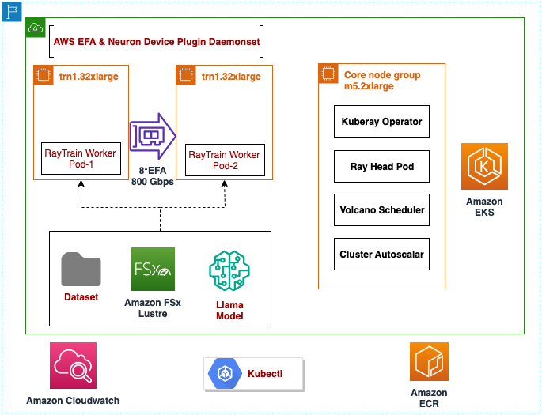

# Instructions for fine-tuning LLama3.1 on AWS Trainium using Ray + Pytorch Lightning + Neuron

## Overview <a name="overview2"></a>

This tutorial shows how to launch a Ray + PTL +  Neuron training job on multiple Trn1 nodes within an Amazon Elastic Kubernetes Service (EKS) cluster. In this example, the Llama3.1 8B model will undergo fine-tuning using the opensource dataset: Hugging face databricks/databricks-dolly-15k. Ray will be used to launch the job on 2 trn1.32xlarge (or trn1n.32xlarge) instances, with 32 cores per instance.

### What are Ray, PTL and Neuron?

[PyTorch Lightning](https://lightning.ai/docs/pytorch/stable/starter/introduction.html) developed by Lightning AI organization, is a library that provides a high-level interface for PyTorch, and helps you organize your code and reduce boilerplate. By abstracting away engineering code, it makes deep learning experiments easier to reproduce and improves developer productivity.

[Ray](https://docs.ray.io/en/latest/ray-core/examples/overview.html) enhances ML workflows by seamlessly scaling fine-tuning and inference across distributed clusters, transforming single-node code into high-performance, multi-node operations with minimal effort.

[AWS Neuron](https://awsdocs-neuron.readthedocs-hosted.com/en/latest/) is an SDK with a compiler, runtime, and profiling tools that unlocks high-performance and cost-effective deep learning (DL) acceleration. It supports high-performance training on AWS Trainium instances. For model deployment, it supports high-performance and low-latency inference on AWS Inferentia

### Combining Ray + PTL + Neuron:
The integration of Ray, PyTorch Lightning (PTL), and AWS Neuron combines PTL's intuitive model development API, Ray Train's robust distributed computing capabilities for seamless scaling across multiple nodes, and AWS Neuron's hardware optimization for Trainium, significantly simplifying the setup and management of distributed training environments for large-scale AI projects, particularly those involving computationally intensive tasks like large language models.

The tutorial covers all steps required to prepare the EKS environment and launch the training job:

 1. [Setup EKS Environment](#setupeksenv)
 2. [Create ECR repo and upload docker image](#createdockerimage)
 3. [Creating Ray Cluster](#creatingraycluster)
 4. [Preparing Data](#preparingdata)
 5. [Fine-tuning Model](#finetuningmodel)
 6. [Monitoring Jobs](#viewingraydashboard)
 7. [Deleting the environment](#cleanup)

# Multi-Node Ray + PTL + Neuron Flow



## 1. Setup EKS Environment <a name="setupeksenv"></a>

### 1.1 Launch a Linux jump host

Begin by choosing an AWS region that supports both EKS and Trainium (ex: us-east-1, us-west-2, us-east-2). 

In your chosen region, use the AWS Console or AWS CLI to launch an instance with the following configuration:

* **Instance Type:** m5.large
* **AMI:** Amazon Linux 2023 AMI (HVM)
* **Key pair name:** (choose a key pair that you have access to) 
* **Auto-assign public IP:** Enabled
* **Storage:** 100 GiB root volume

### 1.2 Configure AWS credentials on the jump host

#### Create a new IAM user in the AWS Console:

Refer to the [AWS IAM documentation](https://docs.aws.amazon.com/IAM/latest/UserGuide/id_users_create.html#id_users_create_console) in order to create a new IAM user with the following parameters:

* **User name:** eks_tutorial
* **Select AWS credential type:** enable `Access key - Programmatic access`
* **Permissions:** choose _Attach existing policies directly_ and then select `AdministratorAccess`

Be sure to record the ACCESS_KEY_ID and SECRET_ACCESS_KEY that were created for the new IAM user.

#### Log into your jump host instance using one of the following techniques:

* Connect to your instance via the AWS Console using [EC2 Instance Connect](https://docs.aws.amazon.com/AWSEC2/latest/UserGuide/Connect-using-EC2-Instance-Connect.html)
* SSH to your instance's public IP using the key pair you specified above.
  * Ex: `ssh -i KEYPAIR.pem ec2-user@INSTANCE_PUBLIC_IP_ADDRESS`

#### Configure the AWS CLI with your IAM user's credentials:

Run `aws configure`, entering the ACCESS_KEY_ID and SECRET_ACCESS_KEY you recorded above. For _Default region name_ be sure to specify the same region used to launch your jump host, ex: `us-west-2`.

<pre style="background: black; color: #ddd">
bash> <b>aws configure</b>
AWS Access Key ID [None]:  ACCESS_KEY_ID
AWS Secret Access Key [None]: SECRET_ACCESS_KEY
Default region name [None]: us-west-2
Default output format [None]: json
</pre>

### 1.3 Set up the EKS environment

Supported US Regions: us-west-2 / us-east-1 / us-east-2

Setup the EKS cluster following the instructions under `Deploying the Solution` section in [data-on-eks documentation](https://awslabs.github.io/data-on-eks/docs/gen-ai/training/Neuron/RayTrain-Llama2#1-deploying-the-solution). 

### 1.4 Setup eksctl, kubectl on your jump host

Once the EKS Cluster is setup, setup eksctl and kubectl on your jump host using the [steps in documentation.](https://docs.aws.amazon.com/eks/latest/userguide/install-kubectl.html)

### 1.5 Verify if the Neuron Device Plugin is running

Use the following kubectl command from your jump host / local
<pre style="background: black; color: #ddd">
kubectl get ds neuron-device-plugin --namespace kube-system
NAME                           DESIRED CURRENT READY UP-TO-DATE AVAILABLE NODE SELECTOR AGE
neuron-device-plugin-daemonset 2         2      2        2          2      <none> 17d
</pre>

### 1.6 Verify that the node has allocatable Neuron cores and devices

<pre style="background: black; color: #ddd">
kubectl get nodes "-o=custom-columns=NAME:.metadata.name,NeuronCore:.status.allocatable.aws\.amazon\.com/neuroncore"
NAME NeuronCore
ip-192-168-65-41.us-west-2.compute.internal 32
ip-192-168-87-81.us-west-2.compute.internal 32
</pre>

### 1.7 Setup docker on your jump host
Setup docker on your jump host using the steps below:

<pre style="background: black; color: #ddd">
sudo yum update -y
sudo yum install -y docker
sudo systemctl start docker
sudo usermod -aG docker ec2-user
sudo chmod 666 /var/run/docker.sock
docker ps
docker --version
</pre>

## 2. Create ECR repo and upload docker image to ECR <a name="createdockerimage"></a>

### 2.1 Clone this repo to your jump host / local host

<pre style="background: black; color: #ddd">
sudo yum install -y git
git clone https://github.com/aws-neuron/aws-neuron-eks-samples.git
cd aws-neuron-eks-samples/llama3.1_8B_finetune_ray_ptl_neuron
</pre>

### 2.2 Execute the script

The script `0-kuberay-trn1-llama3-pretrain-build-image.sh` checks if the ECR repo `kuberay_trn1_llama3.1_pytorch2` exists in the AWS Account and creates it if it does not exist. It also builds the docker image and uploads the image to this repo. 

<pre style="background: black; color: #ddd">
bash> chmod +x 0-kuberay-trn1-llama3-pretrain-build-image.sh
bash> ./0-kuberay-trn1-llama3-pretrain-build-image.sh
bash> Enter the appropriate AWS region: For example: us-west-2
</pre>

If you have required credentials, the docker image should be successfully created and uploaded to Amazon ECR in the repository in the specific AWS region.

Verify if the repository `kuberay_trn1_llama3.1_pytorch2` is created successfully by heading to Amazon ECR service in AWS Console

## 3. Creating Ray cluster <a name="creatingraycluster"></a>

The script `1-llama3-finetune-trn1-create-raycluster.yaml` creates Ray cluster with a head pod and worker pods.

Use the command below to create ray cluster:
<pre style="background: black; color: #ddd">
bash> export AWS_ACCOUNT_ID=<account_id>
bash> export REGION=<region>
bash> sed -i "s/<AWS_ACCOUNT_ID>/$AWS_ACCOUNT_ID/g" 1-llama3-finetune-trn1-create-raycluster.yaml
bash> sed -i "s/<REGION>/$REGION/g" 1-llama3-finetune-trn1-create-raycluster.yaml
bash> kubectl apply -f 1-llama3-finetune-trn1-create-raycluster.yaml
</pre>

The Ray cluster contains 1 head pod and 2 worker pods. Worker pods are deployed on the 2 Trainium instances (trn1.32xlarge). 

## 4. Preparing data <a name="preparingdata"></a>

Use the command below to submit a Ray job for downloading the [databricks/databricks-dolly-15k](https://huggingface.co/datasets/databricks/databricks-dolly-15k) dataset and the Llama3.1 8B model:

<pre style="background: black; color: #ddd">
kubectl apply -f 2-llama3-finetune-trn1-rayjob-create-data.yaml
</pre>

You can check the output of `kubectl get pods` to find out if the job has completed:

<pre style="background: black; color: #ddd">
kubectl get pods
NAME                                              READY   STATUS      RESTARTS   AGE
2-llama3-finetune-trn1-rayjob-create-data-8qjfk   0/1     Completed   0          7m
cmd-shell                                         1/1     Running     0          10d
kuberay-trn1-head-zplg7                           1/1     Running     0          14m
kuberay-trn1-worker-workergroup-lwc2f             1/1     Running     0          14m
kuberay-trn1-worker-workergroup-zsm2z             1/1     Running     0          14m
</pre>

## 5. Monitoring jobs via Ray Dashboard <a name="viewingraydashboard"></a>

To view the Ray dashboard from the browser in your local machine:

<pre style="background: black; color: #ddd">
From your local machine:
kubectl port-forward service/kuberay-trn1-head-svc 8265:8265 &
Head to: http://localhost:8265/
</pre>

You can monitor the progress of the job in Ray Dashboard. 

## 6. Fine-tuning Llama3.1 8B model <a name="finetuningmodel"></a>

Use the command below to submit a Ray job for fine-tuning the model:

<pre style="background: black; color: #ddd">
kubectl apply -f 3-llama3-finetune-trn1-rayjob-submit-finetuning-job.yaml
</pre>

<b> Known Issues:</b> If the Ray job fails with punkt or division by zero errors, see the [Troubleshooting](#troubleshooting) section below. 

Model artifacts will be created under `/shared/neuron_compile_cache/`. Check the Ray logs for “Training Completed” message.

## 7. Clean-up <a name="cleanup"></a>

 When you are finished with the tutorial, run the following commands on the jump host to remove the EKS cluster and associated resources:

```
# Delete Ray Jobs
kubectl delete -f 3-llama3-finetune-trn1-rayjob-submit-finetuning-job.yaml
kubectl delete -f 2-llama3-finetune-trn1-rayjob-create-data.yaml

# Delete Ray Cluster
kubectl delete -f 1-llama3-finetune-trn1-create-raycluster.yaml

# Delete the RayCluster Resources:
cd gen-ai/training/raytrain-llama2-pretrain-trn1
kubectl delete -f llama2-pretrain-trn1-raycluster.yaml

# Clean Up the EKS Cluster and Associated Resources:
cd data-on-eks/ai-ml/trainium-inferentia
./cleanup.sh

```

Lastly, terminate your jump host instance and delete the `eks_tutorial` IAM user via the AWS Console.

## 8. Troubleshooting<a name="troubleshooting"></a>

<b>Known Issues:</b>

<b>If the job fails with the Errors below: </b>

<pre style="background: black; color: #ddd">
[36m(RayTrainWorker pid=3462, ip=100.64.83.225)[0m [nltk_data] '/root/nltk_data/tokenizers/punkt_tab.zip'
[36m(RayTrainWorker pid=3464, ip=100.64.83.225)[0m [nltk_data] Error with downloaded zip file
[36m(RayTrainWorker pid=3483, ip=100.64.83.225)[0m Bad CRC-32 for file 'punkt_tab/czech/ortho_context.tab'
</pre>

<pre style="background: black; color: #ddd">
File "/tmp/ray/session_2024-11-13_06-40-30_347972_17/runtime_resources/working_dir_files/_ray_pkg_5ad2ee50e13a7e91/ray_neuron_xla_config_20.py", line 20, in _set_xla_env_vars
"GROUP_WORLD_SIZE": str(context.get_world_size() / local_world_size),
ZeroDivisionError: division by zero
</pre>

<b>Workaround:</b>
If your Ray fine-tuning job fails with errors associated with `punkt` or `division by zero`, delete the ray job using the commands below, wait for 5 min and re-run it. If the job fails again, wait for 5 more min and re-run the second time.  

<pre style="background: black; color: #ddd">
kubectl delete -f 3-llama3-finetune-trn1-rayjob-submit-finetuning-job.yaml
kubectl apply -f 3-llama3-finetune-trn1-rayjob-submit-finetuning-job.yaml
</pre>

If you still face issues, reach out to us via the [documentation](https://awsdocs-neuron.readthedocs-hosted.com/en/latest/general/contact.html). To report any bugs, raise an issue via the GitHub Issues feature.

<b>Probable Cause:</b>
[Punkt](https://www.nltk.org/api/nltk.tokenize.punkt.html) is a tokenizer used in Natural Language Processing (NLP) that is part of the NLTK (Natural Language Toolkit) library in Python. These errors above seem to be associated with the code trying to use Punkt libraries before they have completely downloaded. We are actively investigating this issue. Till then, follow the workaround above.

## 9. Contributors<a name="contributors"></a>
Pradeep Kadubandi - AWS ML Engineer<br/>
Chakra Nagarajan - AWS Principal Specialist SA - Accelerated Computing<br/>
Sindhura Palakodety - AWS Senior ISV Generative AI Solutions Architect<br/>
