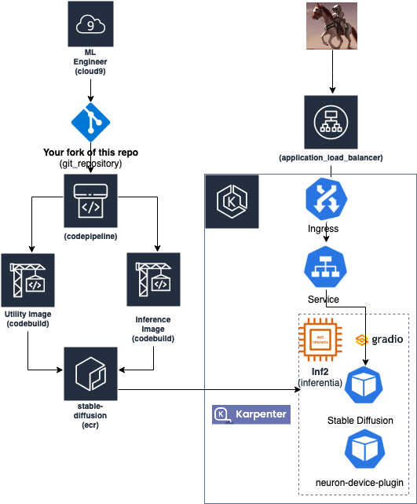

## Deploy sd2_512 inference endpoint

Inference services need to be (1) reliable, (2) performant, and (3) cost-effective. Reliability involves quick and automatic recovering from hardware and software failures. Performant means low latency response to user requests that includes scaling compute accelerators seamlessly, quickly, and keeping resource utilization optimal and finally, releasing resources not needed.  

This solution describes an inference pipeline that implements reliable, performant and cost-effective AWS services using EC2 Inferentia instances.  


For reliability, we use Karpenter. Karpenter node-pool manages Inferentia node lifecycle. Karpenter adds Inferentia nodes to handle unschedulable pods, schedules pods on those nodes, and removes them when not needed. 

Our [NodePool](inf2-nodepool.yaml) uses the instance-familiy key to specify the instances needed i.e., `inf2.xlarge`, `inf2.8xlarge`, `inf2.24xlarge`, and `inf2.48xlarge`. 

```yaml
       - key: karpenter.k8s.aws/instance-family
          operator: In
          values: ["inf2"]
```

The Pod resource limits will determine which Inf2 instance will be requested by the total number of required neuron devices. In the example below the scheduler will launch inf2.xlarge when the replica-set size is 1 and increase linearly by the total number of needed neuron devices. 

```yaml
        resources:
          limits:
            aws.amazon.com/neuron: 1
```

The neuron-device-plugin returns the list of Neuron cores/devices to kublet. Kubelet advertises the Core/Device list to K8s API server (in turn to Kube-Scheduler). Kube-Scheduler picks up the pod creation request. Kube-scheduler calls the neuron-scheduler-extn filter function with a list of nodes and pod specifications. neuron-scheduler scans the nodes and filters out nodes with non contiguous cores/devices and returns the nodes that are capable of supporting the pod specification. Kube-scheduler invokes the neuron-scheduler bind function with pod and node. It updates the pod annotation with allocated neuron contiguous core/device Ids. Then neuron-scheduler sends the bind request to kubelet of the selected node. Kubelet calls the Alloc function of the neuron-device-plugin. neuron-device-plugin queries the pod annotation for allocated core/device Ids and exports the device cores to container runtime. 

The solution performance comprises of the time it takes to bring neuron devices online and prepare them for process inference requests. Neuron runtime requires the model to be compiled to Neuron Executable File Format (NEFF) so that it can be executed on the Inferentia chips. Compiling a model can weigh several gigabytes and delay container startup. Therefore, we load and extract the model files from external storage to `/model` with InitContainer and mount it to the serving pod under `/app` that uses the same `workday` volume.

```yaml
     initContainers:
      - name: pull-model-tar
        image: ${AWS_ACCOUNT_ID}.dkr.ecr.${AWS_REGION}.amazonaws.com/stablediffusion:amd64-neuron-assets
        imagePullPolicy: Always
        volumeMounts:
        - name: workdir
          mountPath: /model
        command:
        - /bin/bash
        - "-exc"
        - |
          set -x
          aws s3 cp s3://sdinfer/stable-diffusion-2-1-base.tar.gz /model/model.tar.gz
          tar -xzf /model/model.tar.gz
     containers:
      - name: app
        image: ${AWS_ACCOUNT_ID}.dkr.ecr.${AWS_REGION}.amazonaws.com/stablediffusion:amd64-neuron
        volumeMounts:
          - mountPath: /app
            name: workdir
...
    volumes:
      - name: workdir
        emptyDir: {}
```

This is a StableDiffusionPipeline based on `stabilityai/stable-diffusion-2-1-base`. Updated compile and benchmark code is in [sd2_512_benchmark](https://github.com/aws-neuron/aws-neuron-sdk/blob/master/src/benchmark/pytorch/sd2_512_benchmark.py) and [sd2_512_compile](https://github.com/aws-neuron/aws-neuron-sdk/blob/master/src/benchmark/pytorch/sd2_512_compile.py)

### Walkthrough
* [Create cluster with Karpenter node pools that provisions `inf2` instances](https://karpenter.sh/docs/getting-started/getting-started-with-karpenter/)
* [Configure pods to use Amazon vpc cni](https://docs.aws.amazon.com/eks/latest/userguide/managing-vpc-cni.html)
```bash
aws eks create-addon --cluster-name ${CLUSTER_NAME} --addon-name vpc-cni --addon-version v1.16.2-eksbuild.1 \
    --service-account-role-arn arn:aws:iam::${AWS_ACCOUNT_ID}:role/AmazonEKSVPCCNIRole
aws eks describe-addon --cluster-name ${CLUSTER_NAME} --addon-name vpc-cni --query addon.addonVersion --output text
```
*  Deploy karpenter nodepool for inferentia
```bash
  cat inf2-nodepool.yaml | envsubst | kubectl apply -f -  
```
* Deploy the Neuron plugin 
```bash
  kubectl apply -f k8s-neuron-device-plugin-rbac.yml
  kubectl apply -f k8s-neuron-device-plugin.yml
  kubectl apply -f k8s-neuron-scheduler-eks.yml
  kubectl apply -f my-scheduler.yml 
```
* [Deploy the OCI image pipeline](./oci-image-build)
* Allow access to model assets S3 bucket using pod identity
```bash
kubectl apply -f sd21-sa.yaml
aws iam create-policy --policy-name allow-access-to-model-assets --policy-document file://allow-access-to-model-assets.json
aws iam create-role --role-name allow-access-to-model-assets --assume-role-policy-document file://trust-relationship.json --description "allow-access-to-model-assets"
aws iam attach-role-policy --role-name allow-access-to-model-assets --policy-arn=arn:aws:iam::${AWS_ACCOUNT_ID}:policy/allow-access-to-model-assets
aws eks create-pod-identity-association --cluster-name yahavb-neuron-demo --role-arn arn:aws:iam::${AWS_ACCOUNT_ID}:role/allow-access-to-model-assets --namespace default --service-account sd21-sa
```
* Deploy a job that compiles the model with Neuron SDK and stage it in S3 bucket ${BUCKET}
```bash
kubectl apply -f sd21-512-compile-job.yaml
```

* The model file is in S3 ${BUCKET}/${MODEL_FILE}.tar.gz; deploy the inference replicaset
```bash
kubectl apply -f sd21-512-server-deploy.yaml
```
Identify the security group that attached to the node that runs the pod launched. The security group description "Communication between all nodes in the cluster"
Add tag `kubernetes.io/cluster/${CLUSTER_NAME}=shared`

* [Deploy AWS Load Balancer controller](https://docs.aws.amazon.com/eks/latest/userguide/aws-load-balancer-controller.html) to enable public ingress access to the inference pods 
```bash
kubectl apply -f sd21-512-serve-svc.yaml
kubectl apply -f sd21-512-serve-ingress.yaml
```

