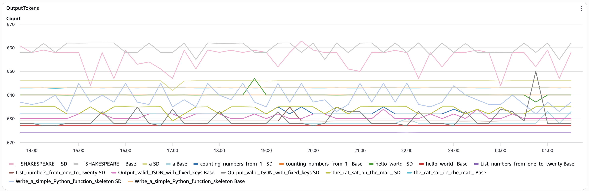

# Speculative Decoding on AWS Trainium2 with vLLM

This sample demonstrates how to improve LLM inference performance on AWS Trainium2 using speculative decoding. We deploy Qwen3-32B with and without speculative decoding to measure the performance improvements when using Qwen3-1.7B as a draft model.

## Understanding Speculative Decoding

Speculative decoding is an inference optimization technique that accelerates token generation by using a smaller, faster "draft" model to predict multiple tokens ahead, which are then verified in parallel by the larger "target" model.

### How It Works

1. **Draft Generation**: A small, fast model (Qwen3-1.7B) generates multiple candidate tokens speculatively
2. **Parallel Verification**: The target model (Qwen3-32B) verifies all candidates in parallel in a single forward pass
3. **Acceptance**: Correct predictions are accepted, incorrect ones are discarded and regenerated
4. **Net Speedup**: When the draft model has good accuracy, multiple tokens are generated per target model forward pass

### Key Benefits

- **Higher Throughput**: Generate more tokens per second by amortizing the cost of target model inference
- **Lower Latency**: Reduce end-to-end generation time for longer outputs
- **Quality Preservation**: Output quality remains identical to standard decoding
- **Cost Efficiency**: Better utilize accelerator resources

### When to Use Speculative Decoding

Speculative decoding is most effective when:
- Generating longer sequences (>256 tokens)
- The draft model has reasonable prediction accuracy for your domain
- You have sufficient memory for both models
- Latency and throughput are critical metrics

## Dynamic Resource Allocation (DRA)

This sample uses Neuron Dynamic Resource Allocation (DRA) to efficiently manage NeuronCore resources on Trainium2 instances. DRA provides fine-grained control over accelerator allocation, enabling:

- **Flexible Resource Claims**: Request specific NeuronCore configurations via ResourceClaimTemplates (RCTs)
- **Efficient Multi-tenancy**: Run multiple workloads with different resource requirements on the same node
- **Optimized Utilization**: Allocate exactly the resources needed for each model configuration

### xl-trn2 ResourceClaimTemplate

We compose an `xl-trn2` RCT that uses half of a trn2.48xlarge instance with 8 Neuron Devices (32 NeuronCores with LNC=1). This configuration is optimal for the Qwen3-32B model, providing the right balance of memory and compute resources.

To carve out 8 consecutive Neuron Devices, the RCT uses:

```yaml
constraints:
  - matchAttribute: resource.aws.com/devicegroup8_id

requests:
  - allocationMode: ExactCount
    count: 8
    deviceClassName: neuron.aws.com
    selectors:
      - cel:
          expression: device.attributes['neuron.aws.com'].instanceType == 'trn2.48xlarge'
```

This ensures the workload receives 8 consecutive devices from the same device group, which is critical for optimal collective communication performance during tensor parallel operations.

For more details, see the [Neuron DRA documentation](https://awsdocs-neuron.readthedocs-hosted.com/en/latest/containers/neuron-dra.html).

## Storage with S3 Mountpoint

Model artifacts and compiled graphs are persisted using Amazon S3 Mountpoint CSI driver, which provides:

- **Persistent Storage**: Compiled models are saved to S3 and reused across pod restarts
- **Fast Compilation**: Avoid recompilation by loading cached artifacts from S3
- **Shared Access**: Multiple pods can access the same compiled models

## Experiment Setup

This sample compares two configurations on Trainium2 (trn2.48xlarge):

| Configuration | Target Model | Draft Model | TP Size | Batch Size | Max Seq Length |
|--------------|--------------|-------------|---------|------------|----------------|
| Baseline | Qwen3-32B | None | 32 | 4 | 1024 |
| With SD | Qwen3-32B | Qwen3-1.7B | 32 | 4 | 1024 |

Both configurations use:
- vLLM 0.9.1 with NeuronX backend
- EAGLE speculative decoding method
- 7 speculative tokens per iteration
- DRA with xl-trn2 ResourceClaimTemplate (32 NeuronCores)

## Performance Results



The experiment tests multiple prompt types to understand when speculative decoding provides benefits. Results are measured using LLMPerf with 64 input tokens and 600 output tokens across different test cases.

### When Speculative Decoding Excels

**Deterministic Sequences** (e.g., "List numbers from one to twenty"):
- Draft model predictions are highly accurate
- Large multi-token blocks get accepted in single iterations
- Significant throughput improvements as multiple decode loops collapse into accepted blocks
- Low validation overhead due to high acceptance rates

### When Speculative Decoding Struggles

**High-Entropy Continuations** (e.g., "Write a simple Python function skeleton", "the cat sat on the mat"):
- Many equally valid wording/structure options exist
- Draft model frequently disagrees with target model
- Low acceptance rates cause extra validation overhead
- Minimal reduction in decode iterations, mostly adding work

### Key Insight

Speculative decoding performance is **workload-dependent**:
- **Predictable sequences**: Converts many decode loops into single accepted blocks → major speedup
- **Creative/varied text**: Adds validation work without reducing iterations → minimal or negative benefit

Test your specific workload patterns to determine if speculative decoding provides value for your use case.

## Prerequisites

- AWS account with permissions to create EKS clusters
- kubectl and helm installed
- AWS CLI configured
- eksctl installed

## Deployment Instructions

### 0. Setup EKS Cluster with Karpenter and Neuron Support

Follow the [Karpenter Getting Started Guide](https://karpenter.sh/docs/getting-started/getting-started-with-karpenter/) to set up your EKS cluster with Karpenter.

Deploy the Neuron node class and Trainium2 node pool:

```bash
kubectl apply -f neuron-al2023-ec2nodeclass.yaml
kubectl apply -f neuron-trn-2-nodepool.yaml
```

### 1. Deploy Neuron DRA Device Plugin

Install the Neuron DRA device plugin using Helm:

```bash
helm install neuron-dra-plugin oci://public.ecr.aws/neuron/neuron-dra-plugin \
  --version 0.1.0 \
  --namespace kube-system
```

Deploy the ResourceClaimTemplates for xl (32 cores) and xxl (64 cores) configurations:

```bash
kubectl apply -f xl-trn2-rct.yaml
kubectl apply -f xxl-trn2-rct.yaml
```

### 2. Setup S3 Storage for Model Artifacts

Create an S3 bucket for storing compiled model artifacts:

```bash
export S3_BUCKET_NAME=your-neuron-models-bucket
export AWS_REGION=us-west-2
export CLUSTER_NAME=your-cluster-name

aws s3 mb s3://${S3_BUCKET_NAME} --region ${AWS_REGION}
```

Create an IAM service account for S3 access:

```bash
eksctl create iamserviceaccount \
  --name s3-csi-driver \
  --namespace default \
  --cluster ${CLUSTER_NAME} \
  --role-name s3-csi-driver-sa-role \
  --region ${AWS_REGION} \
  --attach-policy-arn arn:aws:iam::aws:policy/AmazonS3FullAccess \
  --approve
```

Create the service account manifest:

```bash
cat > s3-csi-driver-sa.yaml <<EOF
apiVersion: v1
kind: ServiceAccount
metadata:
  name: s3-csi-driver
  namespace: default
  annotations:
    eks.amazonaws.com/role-arn: arn:aws:iam::YOUR_ACCOUNT_ID:role/s3-csi-driver-sa-role
EOF

kubectl apply -f s3-csi-driver-sa.yaml
```

Install the S3 CSI driver add-on via the EKS console or AWS CLI, and assign the IRSA role `s3-csi-driver-sa-role`.

Deploy the PersistentVolume and PersistentVolumeClaim:

```bash
kubectl apply -f s3-csi-pv.yaml
```

### 3. Compile Models

Compile the baseline model (without speculative decoding). Set `requests.cpu: 190` to allocate full trn2.48xlarge CPU capacity for faster compilation:

```bash
kubectl apply -f qwen-vllm-compile-deploy.yaml
```

Monitor compilation progress:

```bash
kubectl logs -f deployment/qwen-vllm-compile
```

Once complete, verify the compiled artifacts are saved to S3 at the path specified in `NEURON_COMPILED_ARTIFACTS` (e.g., `/var/mdl/Qwen-32B-1-7B-BS4-SL1k-TP32`).

Compile the speculative decoding model:

```bash
kubectl apply -f qwen-sd-vllm-compile-deploy.yaml
```

Monitor compilation:

```bash
kubectl logs -f deployment/qwen-sd-vllm-compile
```

### 4. Deploy Baseline Configuration (Without Speculative Decoding)

Deploy the baseline Qwen3-32B model without speculative decoding. Set `requests.cpu: 90` to allocate half of trn2.48xlarge CPU capacity and use the xl-trn2 ResourceClaimTemplate:

```bash
kubectl apply -f qwen-vllm-deploy.yaml
```

Wait for the pod to be ready:

```bash
kubectl get pods -l app=qwen-vllm -w
```

### 5. Deploy Speculative Decoding Configuration

Deploy Qwen3-32B with Qwen3-1.7B as the draft model:

```bash
kubectl apply -f qwen-sd-vllm-deploy.yaml
```

Wait for the pod to be ready:

```bash
kubectl get pods -l app=qwen-sd-vllm -w
```

### 6. Setup LLMPerf Benchmark

Create an IAM service account for CloudWatch access:

```bash
eksctl create iamserviceaccount \
  --name sd-llmperf \
  --namespace default \
  --cluster ${CLUSTER_NAME} \
  --role-name sd-llmperf-sa-role \
  --region ${AWS_REGION} \
  --attach-policy-arn arn:aws:iam::aws:policy/CloudWatchFullAccess \
  --approve
```

Create the service account manifest:

```bash
cat > sd-llmperf-sa.yaml <<EOF
apiVersion: v1
kind: ServiceAccount
metadata:
  name: sd-llmperf
  namespace: default
  annotations:
    eks.amazonaws.com/role-arn: arn:aws:iam::YOUR_ACCOUNT_ID:role/sd-llmperf-sa-role
EOF

kubectl apply -f sd-llmperf-sa.yaml
```

### 7. Run Performance Benchmarks

Deploy the LLMPerf benchmark pod:

```bash
kubectl apply -f qwen-llmperf-pod.yaml
```

Monitor the benchmark execution:

```bash
kubectl logs -f pod/qwen-llmperf
```

The benchmark will test both endpoints and publish metrics to CloudWatch.

### 8. View Results in CloudWatch

The LLMPerf benchmark publishes comprehensive metrics to CloudWatch. To view the results:

1. Navigate to CloudWatch in the AWS Console
2. Go to Metrics → All metrics
3. Select the custom namespace `Qwen/LLMPerf`
4. Explore metrics by dimensions:
   - **Variant**: SD (Speculative Decoding) vs Base (Baseline)
   - **TestCase**: Different prompt types tested

Key metrics to compare:
- **OutputTokens**: Primary metric showing throughput differences
- **RequestOutputThroughput**: Tokens per second by variant and test case
- **InterTokenLatency**: Time between tokens
- **EndToEndLatency**: Total request latency
- **TTFT**: Time to first token

Create dashboards to visualize how speculative decoding performs across different prompt types. Focus on OutputTokens and RequestOutputThroughput to see where SD provides the most value.

## Configuration Details

### Baseline Configuration

```bash
vllm serve Qwen/Qwen3-32B \
  --tensor-parallel-size 32 \
  --max-num-seqs 4 \
  --max-model-len 1024 \
  --override-neuron-config '{"save_sharded_checkpoint": true}'
```

Environment variables:
```bash
VLLM_NEURON_FRAMEWORK="neuronx-distributed-inference"
NEURON_COMPILED_ARTIFACTS="/var/mdl/Qwen-32B-1-7B-BS4-SL1k-TP32"
MODEL_ID="Qwen/Qwen3-32B"
```

### Speculative Decoding Configuration

```bash
vllm serve Qwen/Qwen3-32B \
  --tensor-parallel-size 32 \
  --max-num-seqs 4 \
  --max-model-len 1024 \
  --override-neuron-config '{"save_sharded_checkpoint": true, "enable_fused_speculation": true}' \
  --speculative-config '{
    "model": "Qwen/Qwen3-1.7B",
    "num_speculative_tokens": 7,
    "max_model_len": 2048,
    "method": "eagle"
  }'
```

Environment variables:
```bash
VLLM_NEURON_FRAMEWORK="neuronx-distributed-inference"
NEURON_COMPILED_ARTIFACTS="/var/mdl/Qwen-32B-1-7B-BS4-SL1k-TP32-SD"
MODEL_ID="Qwen/Qwen3-32B"
DRAFT_MODEL_ID="Qwen/Qwen3-1.7B"
```

Key parameters:
- `enable_fused_speculation`: Combines draft execution with verification for better performance
- `num_speculative_tokens`: Number of tokens the draft model generates per iteration (7)
- `method`: EAGLE speculative decoding algorithm
- `tensor-parallel-size 32`: Uses xl-trn2 RCT (32 NeuronCores)

## Tuning Recommendations

To optimize speculative decoding for your workload:

1. **Draft Model Selection**: Choose a draft model that balances speed and accuracy for your domain
2. **Speculative Tokens**: Adjust `num_speculative_tokens` (typically 5-10) based on draft model accuracy
3. **Output Length**: Speculative decoding benefits increase with longer output sequences
4. **Batch Size**: Experiment with `max-num-seqs` for your throughput requirements

## Cleanup

```bash
kubectl delete -f qwen-llmperf-pod.yaml
kubectl delete -f qwen-vllm-deploy.yaml
kubectl delete -f qwen-sd-vllm-deploy.yaml
kubectl delete -f qwen-vllm-compile-deploy.yaml
kubectl delete -f qwen-sd-vllm-compile-deploy.yaml
kubectl delete -f s3-csi-pv.yaml
kubectl delete -f xl-trn2-rct.yaml
kubectl delete -f xxl-trn2-rct.yaml
```

## Additional Resources

- [AWS Neuron vLLM Documentation](https://awsdocs-neuron.readthedocs-hosted.com/en/latest/frameworks/torch/torch-neuronx/tutorials/inference/vllm.html)
- [Trainium2 Architecture](https://awsdocs-neuron.readthedocs-hosted.com/en/latest/about-neuron/arch/neuron-hardware/trainium2.html)
- [Speculative Decoding Paper](https://arxiv.org/abs/2211.17192)
- [EAGLE: Speculative Sampling](https://arxiv.org/abs/2401.15077)
