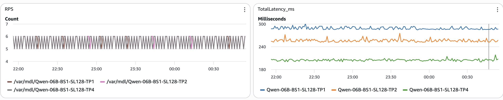

# Optimal Tensor Parallelism for LLM Serving on AWS Trainium2 with vLLM

This sample demonstrates how to optimize Large Language Model (LLM) serving on AWS Trainium2 instances using vLLM with different tensor parallelism (TP) configurations. The experiment compares TP1, TP2, and TP4 configurations to identify the optimal balance between latency and throughput.

## Understanding Tensor Parallelism (TP)

Tensor Parallelism is a model parallelism technique that splits individual layers of a neural network across multiple accelerators. Each accelerator processes a portion of the tensor operations in parallel, then synchronizes results through collective communication operations.

### Key Principles

**How TP Works:**
- Model layers are sharded across multiple NeuronCores
- Each core processes a slice of the computation
- Results are synchronized via all-reduce operations
- Enables serving models that exceed single-core memory capacity

**TP Trade-offs:**
- **Higher TP** = More parallelism but increased communication overhead
- **Lower TP** = Less communication overhead but limited by single-core capacity
- **Optimal TP** = Balances compute efficiency with communication costs

### Why Optimal TP Matters

Not all TP configurations are equal. Using excessive tensor parallelism can actually degrade performance:

1. **Communication Overhead**: Higher TP requires more inter-core synchronization
2. **Underutilization**: Small models on high TP waste accelerator resources
3. **Latency Impact**: Unnecessary communication adds latency to each token generation

The goal is to find the **minimum TP degree** that:
- Fits the model in memory
- Achieves acceptable latency
- Maximizes throughput per accelerator

## Experiment Setup

This sample deploys the Qwen 0.6B model with three different TP configurations on Trainium2:

| Configuration | NeuronCores | Use Case |
|--------------|-------------|----------|
| TP1 | 1 | Minimal parallelism, lowest latency |
| TP2 | 2 | Moderate parallelism |
| TP4 | 4 | Higher parallelism, more overhead |

Each deployment:
- Serves the same Qwen 0.6B model
- Uses vLLM 0.9.1 with NeuronX backend
- Handles max sequence length of 128 tokens
- Exposes an OpenAI-compatible API endpoint

A load generator continuously sends requests to all three services and publishes latency metrics to CloudWatch for comparison.

## Results



The experiment demonstrates that **TP1 provides the best performance** for the Qwen 0.6B model:

- **Lowest Latency**: TP1 achieves the fastest response times due to zero inter-core communication overhead
- **Highest Throughput**: Single-core deployment maximizes tokens/second per NeuronCore
- **Best Efficiency**: No wasted resources on unnecessary parallelism

As TP increases (TP2, TP4), latency increases due to communication overhead, while throughput per core decreases. For this model size, higher TP configurations provide no benefit.

### Analysis

The results clearly show that **optimal TP is model-dependent**:

- **Small models** (like Qwen 0.6B): Fit comfortably in single NeuronCore memory, making TP1 optimal
- **Communication overhead**: Each additional TP degree adds synchronization cost via all-reduce operations
- **Diminishing returns**: Higher TP doesn't improve performance when the model already fits in memory

For larger models that exceed single-core capacity, higher TP becomes necessary. The key is finding the **minimum TP degree** that fits your model while maintaining acceptable performance.

## Key Takeaways

1. **Right-size your TP**: Use the minimum TP degree that fits your model
2. **Measure, don't guess**: Different models have different optimal TP configurations
3. **Consider Data Parallelism**: For higher throughput, scale horizontally with DP (multiple replicas) rather than vertically with excessive TP
4. **Model size matters**: Larger models may require higher TP, but small models like Qwen 0.6B perform best with TP1

## Prerequisites

- AWS account with permissions to create EKS clusters
- kubectl and helm installed
- PersistentVolumeClaim `adhoc-python-packages-deb-pvc` with pre-compiled model artifacts
- IAM permissions for CloudWatch metrics (for load generator)

## Deployment Instructions

### 0. Setup EKS Cluster with Karpenter and Neuron Support

Follow the [Karpenter Getting Started Guide](https://karpenter.sh/docs/getting-started/getting-started-with-karpenter/) to set up your EKS cluster with Karpenter.

Then deploy the Neuron node class and Trainium2 node pool:

```bash
kubectl apply -f neuron-al2023-ec2nodeclass.yaml
kubectl apply -f neuron-trn-2-nodepool.yaml
```

### 1. Deploy the vLLM Services

Deploy all three TP configurations:

```bash
kubectl apply -f qwen-vllm-tp1-deploy.yaml
kubectl apply -f qwen-vllm-tp2-deploy.yaml
kubectl apply -f qwen-vllm-tp4-deploy.yaml
```

Wait for all pods to be ready:

```bash
kubectl get pods -l app=qwen-vllm-tp1
kubectl get pods -l app=qwen-vllm-tp2
kubectl get pods -l app=qwen-vllm-tp4
```

### 2. Deploy the Load Generator

The load generator sends continuous requests to all three services and publishes metrics to CloudWatch:

```bash
kubectl apply -f qwen-vllm-loadgen-deploy.yaml
```

Monitor the load generator logs:

```bash
kubectl logs -f deployment/qwen-vllm-loadgen
```

### 3. View Metrics in CloudWatch

The load generator automatically publishes metrics to CloudWatch. To view the results:

1. Navigate to CloudWatch in the AWS Console
2. Go to Metrics → All metrics
3. Select the custom namespace `qwen-vllm-loadgen`
4. Explore metrics by dimensions:
   - **Model**: Different TP configurations (TP1, TP2, TP4)
   - **Status**: Success/Error for RPS metrics

Key metrics to compare:
- **TotalLatency_ms**: End-to-end request latency showing TP1 as lowest
- **RPS**: Request rate by model and status, demonstrating throughput differences

Create dashboards to visualize how latency increases with higher TP degrees. The data clearly shows TP1 outperforming TP2 and TP4 for this model size, validating the principle of using minimal necessary parallelism.

## Cleanup

```bash
kubectl delete -f qwen-vllm-loadgen-deploy.yaml
kubectl delete -f qwen-vllm-tp1-deploy.yaml
kubectl delete -f qwen-vllm-tp2-deploy.yaml
kubectl delete -f qwen-vllm-tp4-deploy.yaml
```

## Additional Resources

- [AWS Neuron vLLM Documentation](https://awsdocs-neuron.readthedocs-hosted.com/en/latest/frameworks/torch/torch-neuronx/tutorials/inference/vllm.html)
- [Cost-Effective LLM Serving with Optimal TP/DP](https://builder.aws.com/content/2up6OUp0y1P9eBfk4MAa51bLRU8/cost-effective-llm-serving-with-optimal-tpdp-on-eks-using-inf248xl-and-g512xl)
- [Trainium2 Instance Types](https://aws.amazon.com/ec2/instance-types/trn2/)
